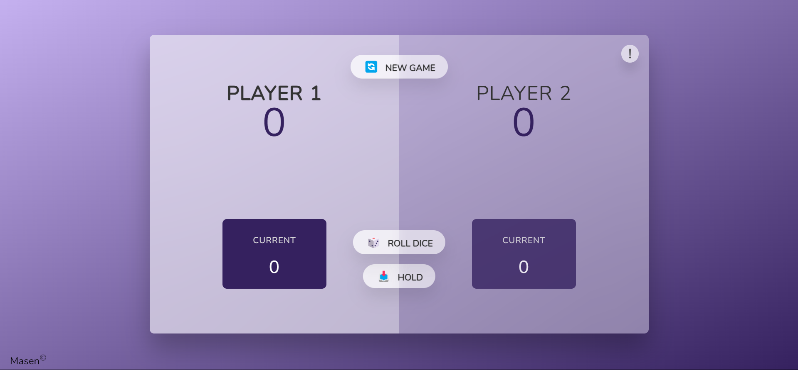

<h1 align="center">Pig Game🐷</h1>

### A dice game with HTML, CSS and dear Javascript : )
### Main project by "Jonas Schmedtmann" from "Udemy"
### Exaplanation of the game is on info section in the program. Read it before start.
### Run the program with live-server on `index.html`
### See demo on [This URL](https://devmasen.github.io/pig-game/) (please use PC, project is not responsive)
